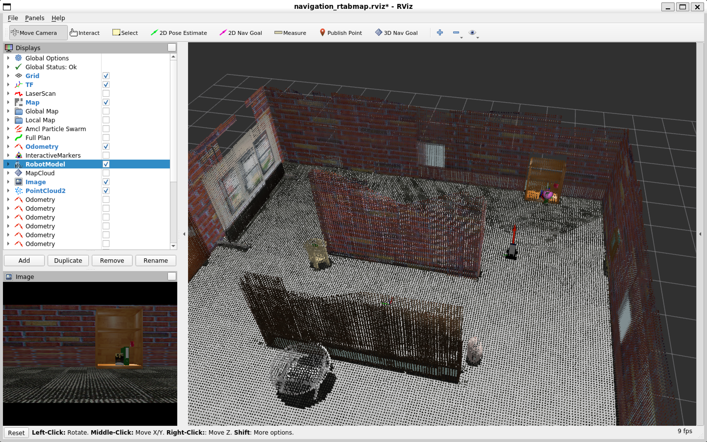
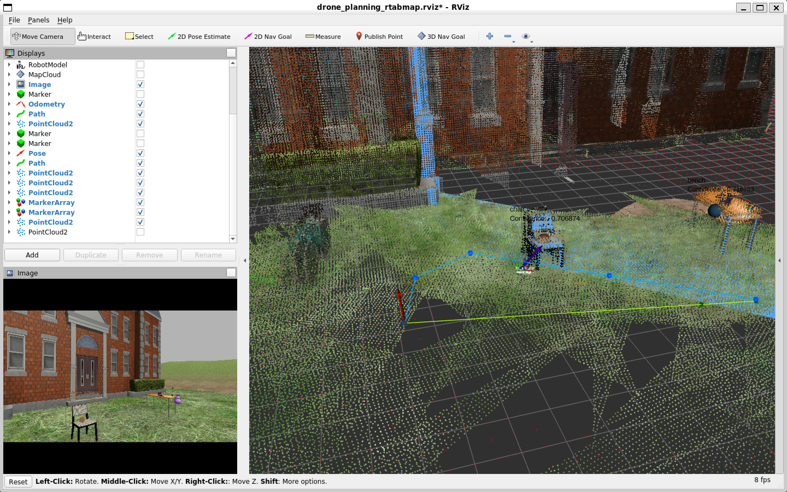

## vision_robot_ros

This package publish Marker Array which has 3D position objects that use feature detection from find-object.

https://github.com/introlab/find-object

This package Publish Marker Array which has 3D position objects that use a Deep Learning model from OpenCV DNN.

# Installation

1. Install ROS Noetic, OpenCV, find-object, Qt, Eigen3, and roslib.

2. Clone vision_robot_ros into your ROS workspace.

```bash
git clone https://github.com/KorawitGems/vision_robot_ros.git
```

# Run

Publish the RGB-D camera topic in the ROS system.

# 1. Feature Detection

Set the object picture name to name_number.png such as cat_1.png, dog_2.png.

Set the picture folder path in the launch file before running.

```bash
roslaunch vision_robot_ros feature_detection_3d.launch
```

<p align="center">
  
</p>

# 2. Object Detection

Train an object detection model such as Tensorflow.

Replace the trained model path in the source code before running.

```bash
roslaunch vision_robot_ros rgbd_object_detect_node.launch
```

<p align="center">
  
</p>
