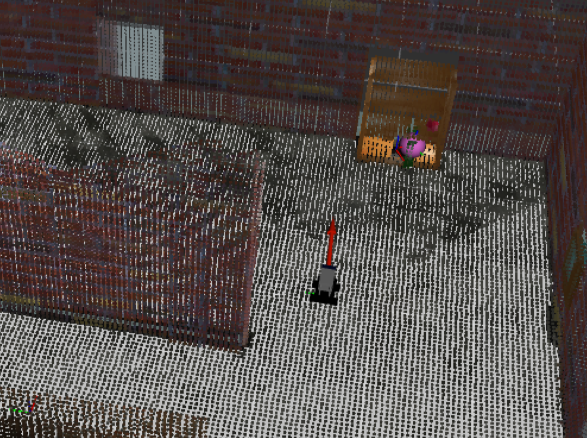
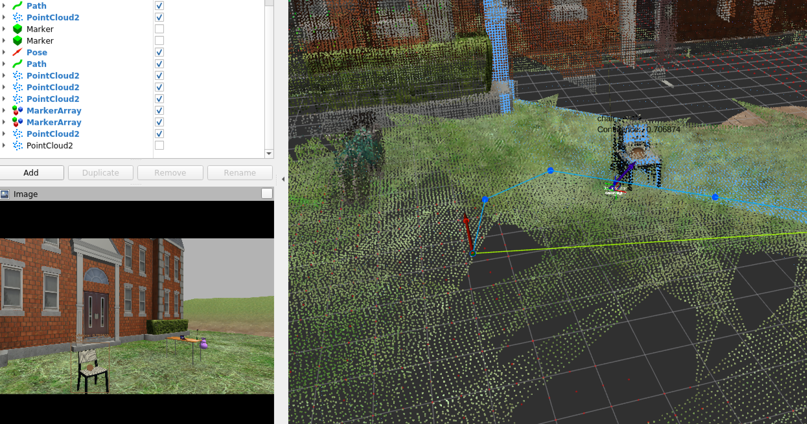

## vision_robot_ros

# Installation

1. Install ROS Noetic, OpenCV, find-object, Qt, Eigen3, roslib and pymongo.

2. Clone vision_robot_ros into your ROS workspace.

```bash
git clone https://github.com/KorawitGems/vision_robot_ros.git
```

# Run

# 1. Feature Detection

This node publishes a Marker Array containing 3D position objects detected using feature detection from find-object.

https://github.com/introlab/find-object

Requirements:

1.Set the object picture name to name_number.png, such as cat_1.png, dog_2.png.
2.Set the picture folder path in the launch file before running.

```bash
roslaunch vision_robot_ros feature_detection_3d.launch
```

<p align="center">
  
</p>

# 2. Object Detection

This node publishes a Marker Array containing 3D position objects detected using a Deep Learning model with OpenCV DNN.

Requirements:

1.Train an object detection model using a deep learning platform such as TensorFlow.
2.Replace the trained model path in the launch file before running.

```bash
roslaunch vision_robot_ros rgbd_object_detect_node.launch
```

<p align="center">
  
</p>

# 3. Object Database

Saved object's position to mongodb.

```bash
roslaunch vision_robot_ros object_mongodb.launch
```